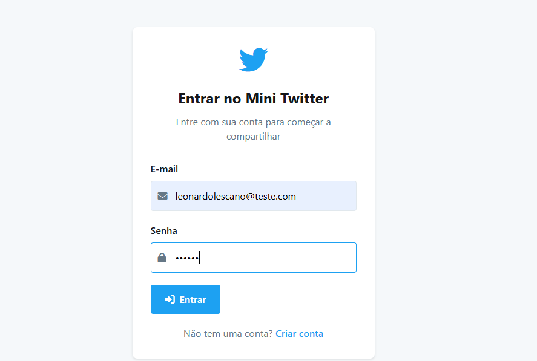
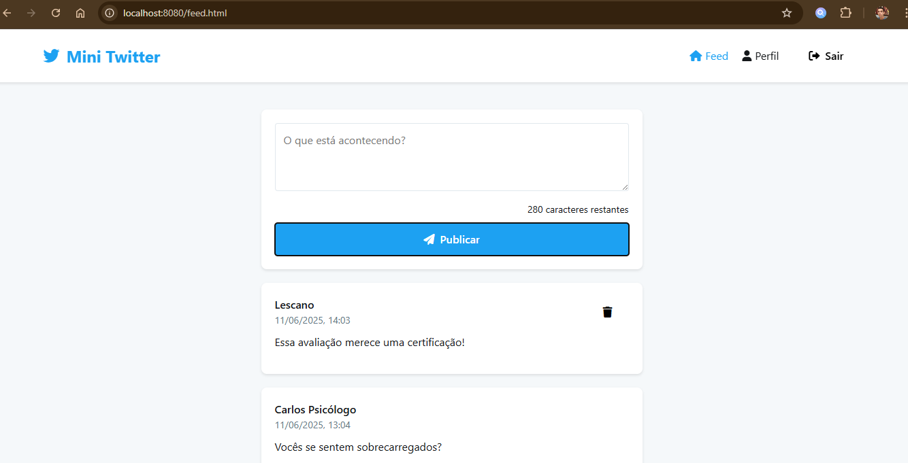
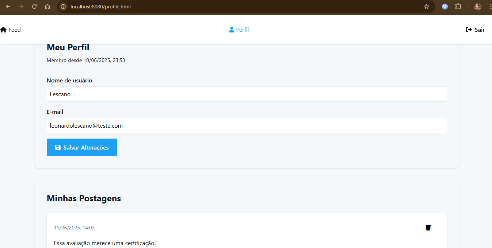

# Mini Twitter 🐦

Uma aplicação web inspirada no Twitter, desenvolvida como projeto para a segunda avaliação da disciplina de tópicos avançados em computação.

## 📝 Sobre o Projeto

O Mini Twitter é uma aplicação web que permite aos usuários:
- Criar uma conta
- Fazer login
- Criar postagens
- Visualizar o feed de postagens
- Gerenciar seu perfil
- Excluir suas próprias postagens

## 🚀 Como Executar

### Pré-requisitos
- Python 3.x instalado
- Navegador web moderno (Chrome, Firefox, Edge, etc.)

### Passos para Execução

1. Clone o repositório:
```bash
git clone https://github.com/lescano-leo/P2-TAC.git
```

2. Navegue até a pasta do projeto:
```bash
cd P2-TAC
```

3. Inicie o servidor Python:
```bash
python server.py
```

4. Acesse a aplicação no navegador:
```
http://localhost:8080
```

## 💻 Funcionalidades

### Autenticação
- **Registro**: Crie uma nova conta com nome de usuário, email e senha
- **Login**: Acesse sua conta com email e senha
- **Logout**: Saia da sua conta de forma segura

### Feed
- Visualize todas as postagens
- Crie novas postagens (até 280 caracteres)
- Exclua suas próprias postagens
- Contador de caracteres em tempo real

### Perfil
- Visualize suas informações
- Atualize seu nome de usuário e email
- Veja todas as suas postagens
- Gerencie suas postagens

## 🔧 Tecnologias Utilizadas

- HTML5
- CSS3
- JavaScript (ES6+)
- Python (Servidor local)
- API REST

## 📱 Interface

A interface foi desenvolvida para ser:
- Responsiva (funciona em desktop e mobile)
- Intuitiva (fácil de usar)
- Moderna (design atual)
- Acessível (boa legibilidade e contraste)

## 🔒 Segurança

- Autenticação via token JWT
- Senhas criptografadas
- Proteção contra XSS
- Validação de dados
- Sanitização de inputs

## 📸 Screenshots

### Página de Login


### Feed de Postagens


### Perfil do Usuário


## 👨‍💻 Autor

**Leonardo R. Lescano**
- Desenvolvimento Frontend
- Integração com API
- Design da Interface
- Documentação

## 📄 Licença

Este projeto está sob a licença MIT. Veja o arquivo [LICENSE](LICENSE) para mais detalhes.

## 🤝 Contribuição

Contribuições são bem-vindas! Para contribuir:

1. Faça um Fork do projeto
2. Crie uma Branch para sua Feature (`git checkout -b feature/AmazingFeature`)
3. Commit suas mudanças (`git commit -m 'Add some AmazingFeature'`)
4. Push para a Branch (`git push origin feature/AmazingFeature`)
5. Abra um Pull Request

## 📞 Suporte

Se encontrar algum problema ou tiver sugestões, por favor:
1. Abra uma issue no repositório
2. Descreva o problema ou sugestão
3. Forneça detalhes sobre seu ambiente (navegador, sistema operacional, etc.)

---

Desenvolvido com 💜 por Leonardo R. Lescano 